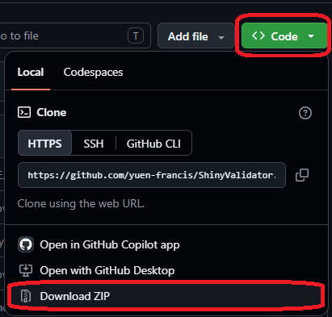
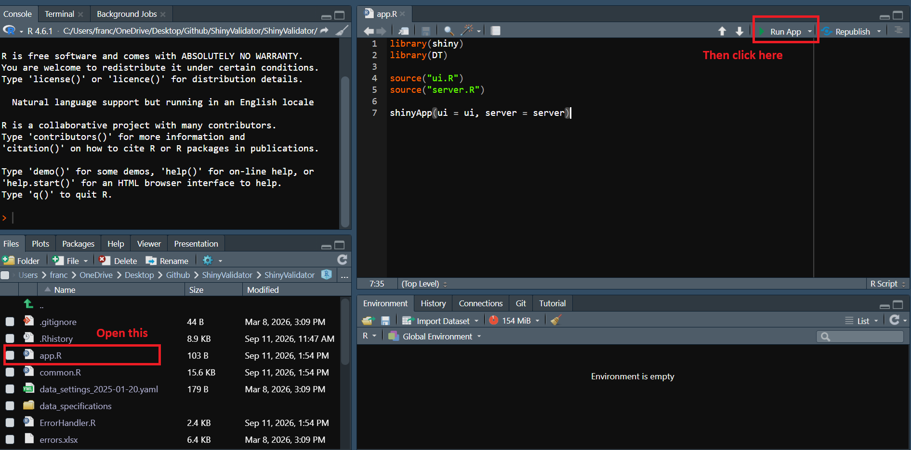

# ShinyValidator

Current version: 2.0.4 (Sept 17, 2026)

See the [Changelog](changelog.md) for a history of updates.

ShinyValidator is a customizable tool for checking research datasets against predefined data specifications. Upload a CSV to identify common data-entry errors, such as missing columns, invalid values, and formatting issues, and download a highlighted Excel file to help locate and correct them.

ShinyValidator is designed as a template that can be adapted to the requirements of your own project. Importantly, the tool was designed to *minimize the need to interface with R*, such that users with minimal R knowledge can nonetheless adapt the validator with ease.

Fork or download this repository to customize it for your project, and use it as an app locally or deploy it using the `rsconnect` package.

You can find a live version of this template [here](https://manybabies.shinyapps.io/shinyvalidator/).

## Components of this repository

This documentation is divided into five sections:

1. [Primary Functions](#1-primary-functions) — how to use the validator and create specifications/configurations.
2. [Adapting the Validator](#2-adapting-the-validator) — how to customize the validator for your own project.
3. [Back-end Developer Documentation](#3-back-end-developer-documentation) — how the validator works and how to modify its code.
4. [File and Folder Structure](#4-file-and-folder-structure)
5. [Summary of the Recommended Workflow](#5-summary-of-the-recommended-workflow)
6. [Package and Version Control](#6-package-and-version-control)

If you are simply creating a validator for your own project, you only need **Sections 1 and 2**.

---

# 1. Primary Functions

The validator contains four main functions, divided into two categories:

### Validator Functions

* **Validation Results** — validate a dataset and identify errors.
* **Specification Details** — view the requirements of the selected data specification.

### Creation Functions

* **Specification Creation** — create a data specification without manually writing YAML.
* **Configuration Creation** — customize the validator's user-facing content and settings without manually editing configuration YAML.

---

<details>
<summary><strong>Requirements</strong></summary>

To run the validator locally, you will need:

* **R** (version 4.6.1)
* **RStudio**

The following R packages are required:

* `tidyverse` (version 2.0.0)
* `shiny` (version 1.14.0)
* `shinythemes` (version 1.2.0)
* `DT` (version 0.34.0)
* `openxlsx` (version 4.2.9)
* `yaml` (version 2.3.12)

If you plan to deploy the validator to shinyapps.io, you will also need:

* `rsconnect` (version 1.11.0)

The exact package environment used by the validator is recorded in `renv.lock`. Running `renv::restore()` will install the versions specified in the lockfile.


</details>

<details>
<summary><strong>Using the Validation Results function</strong></summary>

The **Validation Results** function is the primary way to validate a dataset.

1. **Select a configuration** from the *Configuration* drop-down menu.

2. **Select a study** from the *Study* drop-down menu.

3. **Select a format** from the *Study Format* drop-down menu.

4. **Upload your dataset** by clicking *Browse* and selecting the `.csv` file you want to validate.

5. **Review the validation results.** The validator will indicate whether your dataset is valid.

6. If errors are found, use the **View errors by** options to display errors by:

   * column; or
   * row.

7. You can **directly edit your dataset** using the preview table displayed in the app. The validator will check your edits in real-time and remove highlight if errors no longer persist.
   
8. **Download an edited and highlighted file** by clicking *Download Edited & Highlighted Excel File*. This produces an Excel file containing the original dataset with invalid cells highlighted, along with an **Error Log** describing the detected errors. This downloaded copy will also preserve any edits made in the data table display.

9. Once your data passes validation, the **Download Validated CSV File** button will appear for you to download a standardized .csv for submission.

The available studies and formats depend on the specifications associated with the selected configuration.

</details>

<details>
<summary><strong>Using the Specification Details function</strong></summary>

The **Specification Details** function displays a human-readable description of the selected data specification.

This allows users to check the requirements being applied to their dataset without opening the underlying YAML file.

The specification includes information such as:

* required variables;
* variable descriptions;
* field types;
* allowed values;
* numeric restrictions;
* string restrictions; and
* other validation requirements.

The explanatory text displayed in this section can be customized through the selected configuration.

</details>

<details>
<summary><strong>Data types that the validator can check</strong></summary>

The validator can check:

* **Required columns** — whether all required variables are present.
* **Options** — whether values match a predefined list of allowed values.
* **Numeric values** — whether values are numeric and meet specified range and decimal requirements.
* **Strings** — whether text meets specified capitalization and character-length requirements.
* **Regular expressions** — whether values follow a specified pattern.

The specific checks performed depend on the data specification.

</details>

<details>
<summary><strong>Using Specification Creation</strong></summary>

The **Specification Creation** function allows users to create a YAML data specification without manually writing YAML code.

You have two options for initiating the specification creation:

1. Entering the number of variables required in the specification. The validator will then generate an interface for defining each variable.

2. Upload a sample/template dataset. The validator will extract the column names, and generate an interface for you to provide further specification.

For each variable, you can specify:

* variable name;
* description;
* field type;
* whether the field is required;
* whether `NA` values are allowed;
* allowed options;
* numeric restrictions;
* string restrictions; and
* examples for generating regular-expression restrictions.

Once the specification is complete, click **Download Setup** to download the resulting YAML file.

> **Important:** You can change the number of variables at any time, but decreasing the number of variables will erase some of your progress. For example, reducing the number of variables from 10 to 9 will permanently remove the settings for variable 10.

See **Section 2.5: Creating your data specification** for more information about the available field types and specification workflow.

</details>

<details>
<summary><strong>Using Configuration Creation</strong></summary>

The **Configuration Creation** function allows you to customize the validator without manually editing the configuration YAML file.

Configuration Creation can be used to define:

* the application title;
* a custom logo;
* the welcome message;
* a secondary message;
* the name and contents of **Instruction Set 1**;
* the name and contents of **Instruction Set 2**;
* links displayed in the validator; and
* the specification message.

The names of the instruction sets are customizable. For example, instead of calling the first section *Instruction Set 1*, a project could call it **Getting Started** or **Before You Begin**.

Similarly, the second section could be renamed to something such as **Upload Instructions** or **Data Submission Instructions**.

A custom logo can also be enabled and uploaded through **Configuration Creation**. The uploaded image is saved automatically to the `logos` folder using its original filename, and the filename is automatically recorded in the generated configuration.

Once the configuration is complete, click **Download Configuration** to download the YAML configuration file.

The downloaded configuration can then be placed in the `configuration` folder and selected from the application's **Configuration** drop-down menu.

This allows the same ShinyValidator codebase to support multiple projects or studies with different user-facing instructions and settings.

</details>

<details>
<summary><strong>Creating your own validator</strong></summary>

ShinyValidator is designed as a template. A typical workflow for creating a validator for your own project is:

1. Download or fork the repository.
2. Create or customize a configuration.
3. Create one or more data specifications.
4. Add your specifications to the `data_specifications` folder.
5. Test the validator using example datasets.
6. Customize the appearance or underlying code if needed.
7. Run the validator locally or deploy it online.

> **Try it out:** Launch the validator and try out the built-in Demo specification. The extracted R Project contains a `sample_datasets` folder with valid and invalid datasets. Run these through the validator to see what the output looks like before creating your own specifications.

See **Section 2: Adapting the Validator** for step-by-step instructions.

</details>

---

# 2. Adapting the Validator

This section provides a step-by-step guide for adapting the validator template for your own project.

Before proceeding, please make sure you have everything in the **Requirements** section above installed.

---

<details>
<summary><strong>2.1 Downloading the validator</strong></summary>

The first step is to download the validator from the repository.

Click **Code → Download ZIP** to download the repository as a `.zip` file, then extract it using any file compression program.



</details>

<details>
<summary><strong>2.2 Running the validator locally</strong></summary>

The quickest way to get your validator running is to run it locally.

Open the R Project file `ShinyValidator.Rproj`. Then open `app.R` and click **Run App**.



Note that the exact location of these buttons may differ depending on your RStudio setup. You may be prompted to install any required packages that are not already installed.

The template version of the validator should open in a new window.

You can use this version to create and test your customized configurations and data specifications.

</details>

<details>
<summary><strong>2.3 Understanding configurations</strong></summary>

ShinyValidator separates the **application configuration** from the **data specifications**.

Configurations are stored in the `configuration` folder as YAML files whose names begin with:

```text
config_
```

For example:

```text
config_ManyBabies.yaml
config_default.yaml
```

The configuration controls the user-facing content of the application, including:

* application title;
* welcome message;
* secondary message;
* instruction set names;
* instruction set contents;
* links; and
* specification message.

This means that the same ShinyValidator code can be used with different configurations without modifying the underlying R code.

### Configuration structure

A configuration file follows this general structure:

```yaml
app_title: My Data Validator

welcome_message: Welcome to the validator!

secondary_message:

instruction_set_1_name: Getting Started
instruction_set_1:
- Select a study
- Select a format
- Upload your dataset

links:
- text: Project Website
  url: https://example.com/

instruction_set_2_name: Upload Instructions
instruction_set_2:
- Upload your CSV file
- Check the validation results

specification_message: This is the specification used to validate your dataset.
```

The exact contents can be customized to suit your project.

For most users, the easiest way to create a configuration is to use **Configuration Creation** within the application rather than editing YAML manually.

</details>

<details>
<summary><strong>2.4 Customizing the GUI</strong></summary>

The validator contains several user-facing elements that can be customized for your project.

Most of the content can be changed through the **Configuration Creation** function rather than directly modifying `ui.R`.

The following table summarizes the main customization options:

| Interface element          | Recommended method     | What can be changed                                |
| -------------------------- | ---------------------- | -------------------------------------------------- |
| **Application title**      | Configuration Creation | Application name displayed at the top              |
| **Custom logo**            | Configuration Creation | Upload and display a project logo                  |
| **Welcome message**        | Configuration Creation | Main introductory message                          |
| **Secondary message**      | Configuration Creation | Additional introductory text                       |
| **Instruction Set 1**      | Configuration Creation | Section name and instructions                      |
| **Instruction Set 2**      | Configuration Creation | Section name and instructions                      |
| **Links**                  | Configuration Creation | Link text and destination URLs                     |
| **Specification message**  | Configuration Creation | Description shown above specification details      |
| **Study selection**        | `ui.R` / `server.R`    | Labels and interface behavior                      |
| **Study format selection** | `ui.R` / `server.R`    | Labels and interface behavior                      |
| **CSV upload**             | `ui.R`                 | Upload label and accepted file types               |
| **Error display**          | `ui.R`                 | Labels and display options                         |
| **Validation preview**     | `ui.R` / `server.R`    | Layout and behavior                                |
| **Overall appearance**     | `ui.R`                 | Colors, spacing, fonts, cards, buttons, and layout |

The exact line numbers may change as you customize the application, so it is better to search for the relevant element or input ID rather than relying on line numbers.

> **Tip:** For most projects, you should not need to modify `ui.R` or `server.R`. Use **Configuration Creation** whenever possible.

</details>

<details>
<summary><strong>2.5 Creating your data specification</strong></summary>

The next step is to specify what columns your dataset must contain and what values are allowed for each column.

Data specifications are stored as `.yaml` files in the `data_specifications` folder.

However, **you do not need to write the YAML code yourself**.

Instead, open the validator and navigate to the **Specification Creation** function.

Enter the number of variables you want to include in your specification. The validator will then generate fields for you to define each variable.

There are three main variable types:

* **Options** — values must match one of a predefined set of options.
* **Numeric** — values must be numeric and can optionally be restricted by range and decimal requirements.
* **String** — values can be open-ended but can be restricted by capitalization, character length, or a regular expression.

### Options

Use **Options** when you want to specify exactly which values are allowed.

For example, a `color` variable could allow only:

* `red`
* `yellow`
* `blue`

### Numeric

Use **Numeric** when a variable should contain numbers.

You can optionally specify:

* a minimum value;
* a maximum value;
* whether decimal values are allowed; and
* the minimum and maximum number of decimal places.

For example, a `reaction_time_ms` variable could be restricted to values between `300` and `10000`.

### String

Use **String** when a variable contains open-ended text.

You can optionally restrict:

* capitalization;
* minimum character length; and
* maximum character length.

You can also provide examples to generate a regular-expression-based restriction for variables that follow a consistent pattern.

</details>

<details>
<summary><strong>2.6 Adding your data specification</strong></summary>

Once you have finished defining your variables, click **Download Setup** to download your `.yaml` specification.

Data specifications must be named according to the configuration, study, and format they belong to.

The general naming structure is:

```text
configuration_study_format.yaml
```

For example:

```text
ManyBabies_FishSpeed_RawData.yaml
```

This identifies:

| Component     | Value        |
| ------------- | ------------ |
| Configuration | `ManyBabies` |
| Study         | `FishSpeed`  |
| Format        | `RawData`    |

The configuration name corresponds to the configuration file:

```text
config_ManyBabies.yaml
```

The specification should then be placed in:

```text
data_specifications/
```

For example:

```text
data_specifications/
└── ManyBabies_FishSpeed_RawData.yaml
```

> **Important:** The configuration, study, and format names must match the names used by the application. Avoid spaces and special characters in filenames.

After adding the file, relaunch the application. The appropriate study and format should now appear when the corresponding configuration is selected.

</details>

<details>
<summary><strong>2.7 Testing your specification</strong></summary>

Before using your validator with real datasets, test your new specification with a small sample dataset.

Ideally, create a `.csv` file containing:

* at least one row with completely valid data; and
* several rows containing errors that you expect the validator to detect.

Upload this dataset to the validator and check that the expected errors are identified.

Test several types of errors, including:

* missing required columns;
* invalid option values;
* invalid numeric values;
* values outside permitted ranges;
* incorrect decimal places;
* incorrect capitalization;
* strings that are too short or too long; and
* values that do not match regular-expression requirements.

You can also click **Download Highlighted File** to create an Excel version of the dataset with invalid cells highlighted.

</details>

<details>
<summary><strong>2.8 Creating a configuration</strong></summary>

If your project requires customized instructions or multiple configurations, use the **Configuration Creation** function.

The configuration creator allows you to specify:

### Application information

* Application title
* Custom logo
* Welcome message
* Secondary message

### Instructions

* Instruction Set 1 name
* Instruction Set 1 content
* Instruction Set 2 name
* Instruction Set 2 content

The instruction set names are fully customizable. This allows the same underlying application to use terminology appropriate to different projects.

### Links

You can add links to relevant project websites, documentation, registration pages, or other resources.

### Specification information

You can define the message displayed above the human-readable specification.

Once complete, click **Download Configuration**.

Place the resulting file in:

```text
configuration/
```

Configuration files should follow the naming convention:

```text
config_ProjectName.yaml
```

For example:

```text
config_ManyBabies.yaml
```

The project name is then used to associate the configuration with its corresponding data specifications.

If a custom logo is enabled, the uploaded image is saved in the project's `logos/` folder. The configuration YAML records the logo filename so that the image can be displayed when that configuration is selected.

</details>

<details>
<summary><strong>2.9 Making manual adjustments</strong></summary>

If you discover that your configuration or specification needs to be changed after testing, you can either recreate it using the appropriate creation function or edit the `.yaml` file directly.

The YAML files contain the same information represented by the creation interfaces, but in a format that can be edited manually.

For most users, the **Specification Creation** and **Configuration Creation** functions are the easiest way to make changes.

Manual editing can be useful when making small changes to an existing configuration or specification.

Once your validator is working as expected, you can use it locally or deploy it online using `shinyapps.io`.

</details>

<details>
<summary><strong>2.10 Deploying the validator</strong></summary>

Once your validator has been tested locally, it can be deployed to `shinyapps.io` using the `rsconnect` package.

A typical deployment workflow is:

1. Install `rsconnect`.
2. Connect RStudio to your `shinyapps.io` account.
3. Open the ShinyValidator project.
4. Run the application locally and confirm that it works.
5. Deploy the application using the RStudio publishing tools or `rsconnect`.

The configuration files and data specifications contained in the project should be included in the deployed application.

</details>

---

# 3. Back-end Developer Documentation

The **Back-end Developer Documentation** provides detailed information about the underlying code of the validator.

This section is intended for researchers and developers who wish to add new functions, modify existing functionality, or otherwise customize the validator beyond the options described in Section 2.

If you only want to create a validator for your own project, you generally do not need to modify the code described in this section.

---

<details>
<summary><strong>3.1 Application architecture</strong></summary>

The validator is organized across five primary R files:

| File             | Purpose                                            |
| ---------------- | -------------------------------------------------- |
| `app.R`          | Application initialization and launch              |
| `ui.R`           | User interface, layout, and styling                |
| `server.R`       | Server-side application logic and reactive outputs |
| `common.R`       | Shared functions and dataset validation            |
| `ErrorHandler.R` | Error handling and downloadable validation reports |

The validator also relies on two important collections of YAML files:

| Folder                 | Purpose                                                    |
| ---------------------- | ---------------------------------------------------------- |
| `configuration/`       | Defines application-level settings and user-facing content |
| `data_specifications/` | Defines study- and format-specific dataset requirements    |

The general relationship between these components is:

```text
Configuration
     │
     ├── Application title
     ├── Instructions
     ├── Links
     └── Specification message
     │
     ▼
Selected configuration
     │
     ▼
Study + Format
     │
     ▼
Data specification
     │
     ▼
Uploaded CSV
     │
     ▼
validate_dataset()
     │
     ├── Validation Results
     ├── Validation Preview
     ├── Error Display
     └── Highlighted Excel Download
```

</details>

<details>
<summary><strong>3.2 Configuration system</strong></summary>

The configuration system allows the same Shiny application code to support multiple projects or study collections.

Configuration files are stored in:

```text
configuration/
```

and must begin with:

```text
config_
```

For example:

```text
config_default.yaml
config_ManyBabies.yaml
```

`ui.R` identifies available configuration files automatically using the filename pattern:

```r
^config_.+\.(yaml|yml)$
```

The selected configuration is loaded reactively in `server.R`.

The configuration determines application-level content such as:

```yaml
app_title:
welcome_message:
secondary_message:
instruction_set_1_name:
instruction_set_1:
links:
instruction_set_2_name:
instruction_set_2:
specification_message:
```

This approach means that user-facing content can be changed without modifying the application logic.

### Configuration-specific specifications

Specifications are associated with configurations through their filenames.

For a configuration:

```text
config_ManyBabies.yaml
```

a corresponding specification might be:

```text
ManyBabies_MB1_subjects.yaml
```

The configuration name is extracted from the configuration filename and used by `server.R` to identify the appropriate specifications.

This prevents specifications belonging to different projects from being mixed together.

</details>

<details>
<summary><strong>3.3 app.R</strong></summary>

`app.R` is the entry point for the Shiny application. It:

1. Loads the core application components.
2. Sources `ui.R` and `server.R`.
3. Launches the application with `shinyApp()`.

The file generally does not need to be modified when adapting the validator.

If additional R files are added, they should generally be sourced from the appropriate component file rather than directly from `app.R`.

</details>

<details>
<summary><strong>3.4 ui.R</strong></summary>

`ui.R` defines the application's user interface, layout, and visual styling.

The sidebar provides:

* configuration selection;
* study selection;
* format selection;
* CSV upload; and
* navigation between the validator functions.

The main panel contains four functions:

* **Validation Results**
* **Specification Details**
* **Specification Creation**
* **Configuration Creation**

### Dynamic UI

Several parts of the interface are generated dynamically using `uiOutput()` and server-side `renderUI()` calls.

Examples include:

* study selection;
* study format selection;
* configuration creation fields;
* specification creation variable tabs;
* validation errors;
* specification details.

### JavaScript components

A small JavaScript component in `ui.R` updates dynamically generated labels in the specification and configuration creation interfaces.

For example, variable tabs are automatically renamed as users enter variable names.

The configuration creation interface also updates the displayed instruction-set headings when users change the names of Instruction Set 1 or Instruction Set 2.

These JavaScript components should generally be left unchanged unless the corresponding UI elements are modified.

### Styling

The application uses custom CSS in `ui.R` to provide:

* application header styling;
* content cards;
* purple accent colors;
* styled navigation;
* form controls;
* buttons;
* validation tables; and
* other visual elements.

The application also uses `shinythemes` for the base theme and `DT` for interactive validation tables.

</details>

<details>
<summary><strong>3.5 server.R</strong></summary>

`server.R` contains the server-side logic for the application. It connects UI inputs to the validation functions in `common.R` and generates the application's outputs.

### Configuration loading

The selected configuration is loaded using a reactive expression:

```r
selected_config <- reactive({
  req(input$configuration)
  yaml::read_yaml(
    file.path("configuration", input$configuration)
  )
})
```

The configuration name is also extracted from the selected filename so that the appropriate data specifications can be identified.

### Study and format selection

Available specifications are determined from the selected configuration.

For example, if the selected configuration is:

```text
ManyBabies
```

the application searches for specifications beginning with:

```text
ManyBabies_
```

This allows different configurations to have different collections of studies and formats.

### Main server components

`server.R` contains logic for:

* loading the selected configuration;
* identifying available specifications;
* generating study and format selectors;
* displaying configuration-specific instructions;
* displaying specification details;
* validating uploaded datasets;
* displaying errors by column or row;
* generating the validation preview;
* generating highlighted Excel downloads;
* creating specification fields dynamically;
* creating configuration fields dynamically;
* generating downloadable YAML specifications; and
* generating downloadable YAML configurations.

### Validation workflow

The main validation outputs follow this general workflow:

1. Identify the selected configuration.
2. Identify the selected study and format.
3. Construct the corresponding specification filename.
4. Load the YAML specification.
5. Read the uploaded CSV dataset.
6. Pass the specification and dataset to `validate_dataset()` in `common.R`.
7. Process the returned issues.
8. Display the results or generate the highlighted Excel file.

Configuration-specific specification paths generally follow:

```r
yaml_file_path <- paste0(
  "data_specifications/",
  selected_configuration_name(),
  "_",
  input$study,
  "_",
  input$format,
  ".yaml"
)
```

It is important that all validation-related outputs use this same configuration-aware naming structure.

</details>

<details>
<summary><strong>3.6 common.R</strong></summary>

`common.R` contains the core data-validation functions used by the application.

### Study and format discovery

Available specifications are identified from the YAML files stored in `data_specifications`.

The configuration name is used to distinguish specifications belonging to different configurations.

For example:

```text
ManyBabies_MB1_subjects.yaml
```

can be interpreted as:

| Component     | Value        |
| ------------- | ------------ |
| Configuration | `ManyBabies` |
| Study         | `MB1`  |
| Format        | `subjects`    |

Adding a correctly named specification automatically makes it available to the corresponding configuration.

### Dataset validation

`validate_dataset()` is the main validation function. It:

1. Checks that all required columns are present.
2. Passes each existing field to `validate_dataset_field()`.
3. Collects validation issues.
4. Returns whether the dataset is valid and, if not, a list of issues.

`validate_dataset_field()` determines which validation function should be used based on the field specification.

| Field type | Validation function                     |
| ---------- | --------------------------------------- |
| `options`  | `ValidateOption()`                      |
| `numeric`  | `ValidateNumeric()`                     |
| `string`   | `ValidateString()` or `ValidateRegex()` |

### Validation functions

The individual validation functions perform the following checks:

* **`ValidateOption()`** — checks whether values match one of the allowed options.
* **`ValidateNumeric()`** — checks numeric values, ranges, decimal restrictions, and decimal places.
* **`ValidateString()`** — checks capitalization and character-length restrictions.
* **`ValidateRegex()`** — checks values against a specified regular expression.
* **`GenerateRegex()`** — generates a regular expression from compatible example values.

All validation functions return the same basic structure:

```r
list(TRUE, NULL)
```

when the field is valid, or:

```r
list(FALSE, issue)
```

when an error is detected.

Issues contain information such as the error type, column, invalid value, and row number. This standardized structure allows the server and error-handling components to process validation errors consistently.

### Error explanations

`explain_error()` converts validation issues into user-facing explanations.

It uses the field specification to describe the relevant requirement while allowing individual fields to provide a custom `error_message`.

### Developer notes

When adding a new validation function, maintain the existing return structure and include the affected column and row information in the issue object.

If adding a new field type, update `validate_dataset_field()` so that the new type is routed to the appropriate validation function.

</details>

<details>
<summary><strong>3.7 ErrorHandler.R</strong></summary>

`ErrorHandler.R` contains the functions used to generate downloadable Excel validation reports.

### `highlight_csv_to_xlsx()`

`highlight_csv_to_xlsx()` takes the uploaded dataset and the validation issues returned by `validate_dataset()` and creates an Excel workbook containing:

* **Data** — the original dataset, with invalid cells highlighted.
* **Error Log** — a record of missing columns and invalid cells, including the row, column, and invalid value where applicable.

Missing columns are recorded in the error log but cannot be highlighted in the dataset because the column does not exist.

The function returns an `openxlsx` workbook object, which is saved by the download handler in `server.R`.

### Developer notes

If new issue types are added to `common.R`, update `highlight_csv_to_xlsx()` if those issues should appear in the downloadable error report.

</details>

---

# 4. File and Folder Structure

A typical ShinyValidator project contains the following structure:

```text
ShinyValidator/
│
├── app.R
├── ui.R
├── server.R
├── common.R
├── ErrorHandler.R
├── ShinyValidator.Rproj
│
├── configuration/
│   ├── config_default.yaml
│   └── config_ManyBabies.yaml
│
├── data_specifications/
│   ├── ManyBabies_StudyA_Format1.yaml
│   └── ManyBabies_StudyB_Format1.yaml

```

The most important distinction is:

**Configurations define how the validator behaves and what it tells the user.**

**Specifications define what the user's dataset must contain.**

This separation allows the same application code to be reused across different projects.

---

# 5. Summary of the Recommended Workflow

For most users, creating a new validator should require little or no R programming.

The recommended workflow is:

```text
1. Download ShinyValidator
          ↓
2. Run the app locally
          ↓
3. Create a configuration
          ↓
4. Create one or more specifications
          ↓
5. Add specifications to data_specifications/
          ↓
6. Test with sample datasets
          ↓
7. Customize the UI if necessary
          ↓
8. Deploy locally or to shinyapps.io
```

The **Configuration Creation** and **Specification Creation** functions are intended to handle most customization needs. Direct modification of `ui.R`, `server.R`, or `common.R` should generally only be necessary when adding functionality beyond the existing template.

# 6. Package and version control

This project uses [`renv`](https://rstudio.github.io/renv/) to keep track of the R version and package versions used by the validator.

The file `renv.lock` records the tested environment and should be committed to GitHub.

### For developers

Do not update packages in the main project environment without testing the application.

If packages need to be updated:

1. Create a Git branch.
2. Update the required packages.
3. Test all major validator functions locally.
4. If everything works, run `renv::snapshot()` to update `renv.lock`.
5. Commit the updated `renv.lock` together with the application changes.
6. Deploy and test the updated application.

If an update causes problems, the previous `renv.lock` can be restored from Git to return to the previous known-good environment.

To recreate the project environment on a new computer, open the project in RStudio and run:

```r
renv::restore()
```
