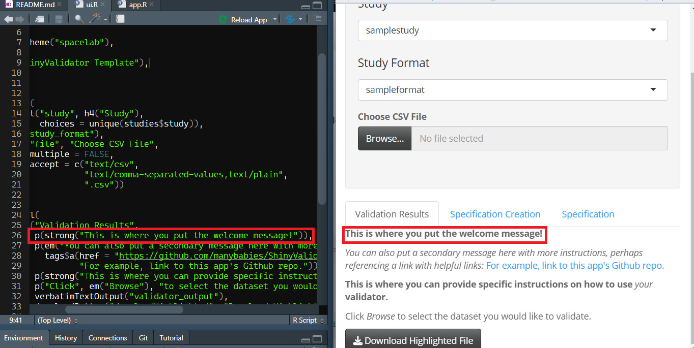
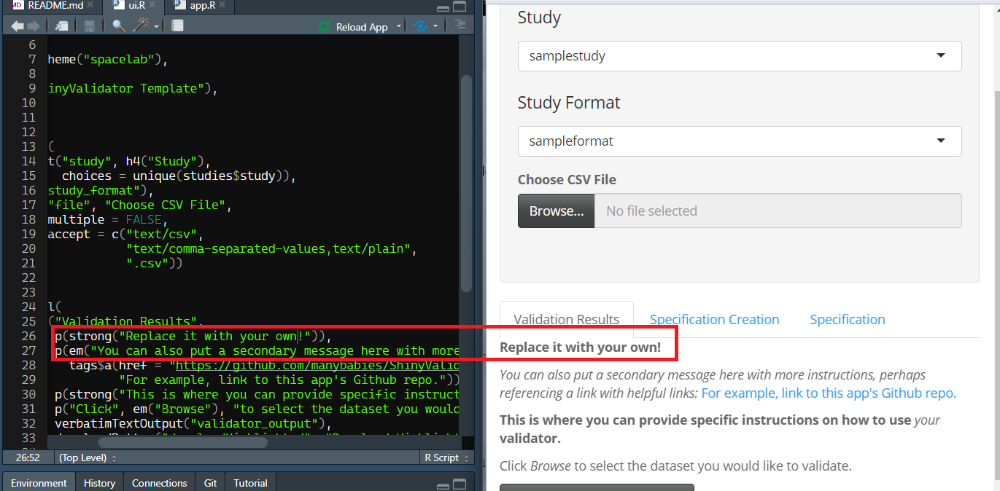
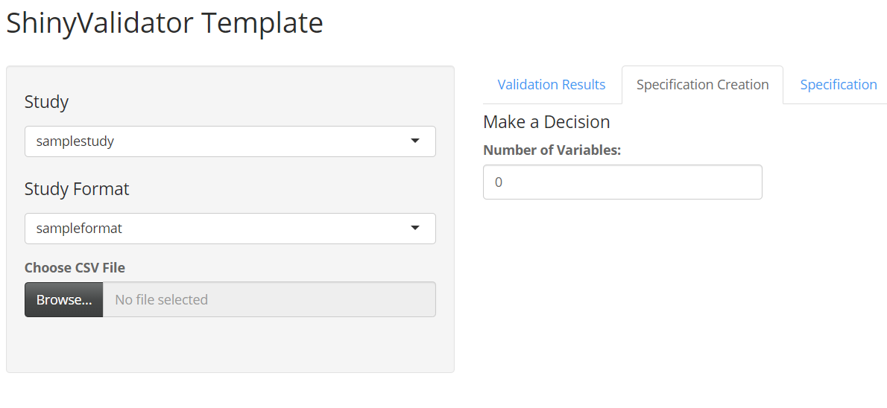

# ShinyValidator
Template GUI to validate datasets. Fork this template to customize for your project needs,
and use as an app locally or deploy via the `rsconnect` package. You can find a live version of this template [here](https://manybabies.shinyapps.io/shinyvalidator/).

## Components of this repo

There are two main sections of this repository. The **Front-end User Information** section contains critical information and a step-by-step guide for adapting the basic validator for your projects. The **Back-end Information** contains more detailed documentation of the underlying code for researchers who wish to add more functions to their validator. If you are looking to simply make a version of the validator for your own projects, you do not need to consult the **Back-end Information** section.

**Front-end User Information**

* [Dependencies](#dependencies)
* [How to use the validator](#how-to-use-the-validator)
* [Step-by-step guide](#step-by-step-guide)

**Back-end Information**

* [The "look" of the GUI - ui.R and server.R](#the-look-of-the-gui)
* [common.R - Function specifications](#commonr---validators-functions)
* [data_specifications and yaml files](#data_specifications-and-yaml-files)

## Dependencies

You will need an up-to-date version of R (at least 4.1.1) and RStudio. The following R packages are required to run the scripts in this repo: `tidyverse`, `shiny`, `shinythemes`, `openxlsx`, and `yaml`. To deploy the app on [shinyapps.io](https://www.shinyapps.io/) instead of running it locally, you will also need `rsconnect`. This application was created using R version 4.1.1.

## How to use the validator

The basic version of the validator is straightforward to use. Here is a quick demo (note: to try out the demo, first download the validator from the repo. See **Downloading the validator** below):

1. Go to the [template version of the app](https://manybabies.shinyapps.io/shinyvalidator/).

2. Select a study from the *Study* drop down menu (e.g. **samplestudy**)

3. Select a format from the *Study Format* drop down menu (e.g. **sampleformat**)

4. Click *Browse* and select a dataset to validate (e.g. **sample_data_valid.csv** or **sample_data_notvalid.csv**)

5. Output window will display whether dataset is valid, and if not valid, which variables/columns need to be fixed.

6. To easily locate the incorrect cells, you can click the *Download Highlighted File* button to download a spreadsheet that highlights all incorrect values.

## Step-by-step guide

### Downloading the validator

The first step is to download the validator from the repository. Click on **Code -> Download ZIP** to download the .zip file, then extract the .zip file using any compressor of your choice (e.g. WinZip).

### Locally deploying your validator

The quickest way to get your validator up and running is to run it *locally* instead of deploying it on ShinyApp. To do so, open the RProject file *ShinyValidator.Rproj*. Then in your RStudio, open *app.R* and click on **Run App**. (Note: You may be prompted to install relevant packages if you haven't already).

The template version of the validator should open up in a new window. You can use this locally as-is, and we will use this to generate your customized .yaml files later.

From here, there are two main components of the validator you would likely want to customize: The Graphical User Interface (GUI) and the data template. The GUI is controlled by *ui.R*, whereas the data templates are dependent on *.yaml* files stored in the *data_specifications* folder. Here is a step-by-step guide on tailoring these two components:

### Customizing your GUI

Your locally deployed app should have several stand-in messages. These messages can be customized in the *ui.R* file by finding the corresponding line of code. For instance, if you would like to have a welcome message, you can adjust the corresponding line 26. 

For example, you can simply replace the message with your own and click **Reload App** to see your changes.

You can similarly change any of the other fields by finding where the corresponding code is. The template version of the validator provides a few useful fields that an average user may need, but you can add more if you are familiar with using Markdown.

### Creating your data template

The last step is to specify your data template, i.e. what columns/variables must a dataset have, and what values are "allowed" for each column/variable. The specifications are stored as .yaml files in the **data_specifications** folder, but **you do not need to hand write the code yourself**!

Open your locally deployed validator, and navigate to the **Specification Creation** tab. You will see a single field that asks how many variables you would like to have for your data template:

Once you enter a number, several new fields will appear for you to specify your columns/variables. For the most part, these fields should be self-explanatory. **IMPORTANT NOTE** If you change the number of variables at any point, **you will lose your progress**.

There are three variable types that the validator can check: **options**, **numeric**, and **strings**:

- Options: This variable type allows you to specify which **exact entries** are allowed. For instance, if I have a variable called "color," and the only possible values are "red", "yellow", and "blue", I would specify as such:

- Numeric: This variable type allows you to specify that a particular column can only take numeric values. In addition, you can create a range restriction to further constrain the maximum and minimum values that are allowed. For instance, if I have a variable "reaction_time_ms" with a minimum value of 300 and a maximum of 10000, I would specify as such:

- String: This variable type allows for open-ended entries (useful if it is impractical to list out all possible entries), but can be used to place restrictions on capitalization as well as maximum character length. For instance, if I am conducting a large-scale collaborative project where I collect individual lab ids, I may want to allow for open-ended entries for labs to choose what they would like to be called (lab_id). That said, I may want a character limit (e.g. 10 characters) so people don't get too creative, and want to remove all capitalization for easier processing. I would then specify as such:

After specifying all your variables, you can click the **Download Setup** button to download a copy of your .yaml file. The final thing to do is to move the .yaml file into the **data_specifications** folder, and rename it following this naming scheme: *studyname_formatname*. For example, if this particular data template is for a study called "fishspeed" and this is the raw data file, I would name this .yaml file *FishSpeed_RawData*. **Note: the file name must not contain spaces or special characters. Use capitalization to separate words**

Once you place the renamed .yaml file in the **data_specifications** folder, relaunch your app. You should now be able to find your study and format in the dropdown menu on the left!

### Testing your template

The final step is to test your newly created template. Create a .csv file that contains all of the relevant columns (or, if you have an existing dataset, use that!). Created one row that contains zero errors (i.e. perfect data entry), and a few rows that contain some errors you anticipate seeing.

In your app, click **Browse** and navigate to this sample dataset. It should correctly identify all the errors you intentionally made. For easier comparisons, click the **Download Highlighted File** button to download a spreadsheet that highlights all errors.

### Troubleshooting and minor adjustments

After testing your template, if you noticed something is not working as intended (or if you overlooked a specification that you need), you can either remake the entire template following the steps above, or manually make adjustments by opening the .yaml file. The .yaml file is simply a less user-friendly version of the specification creation page.

## common.R - Validator's Functions

*information about the backend to be added*

## data_specifications and yaml files
